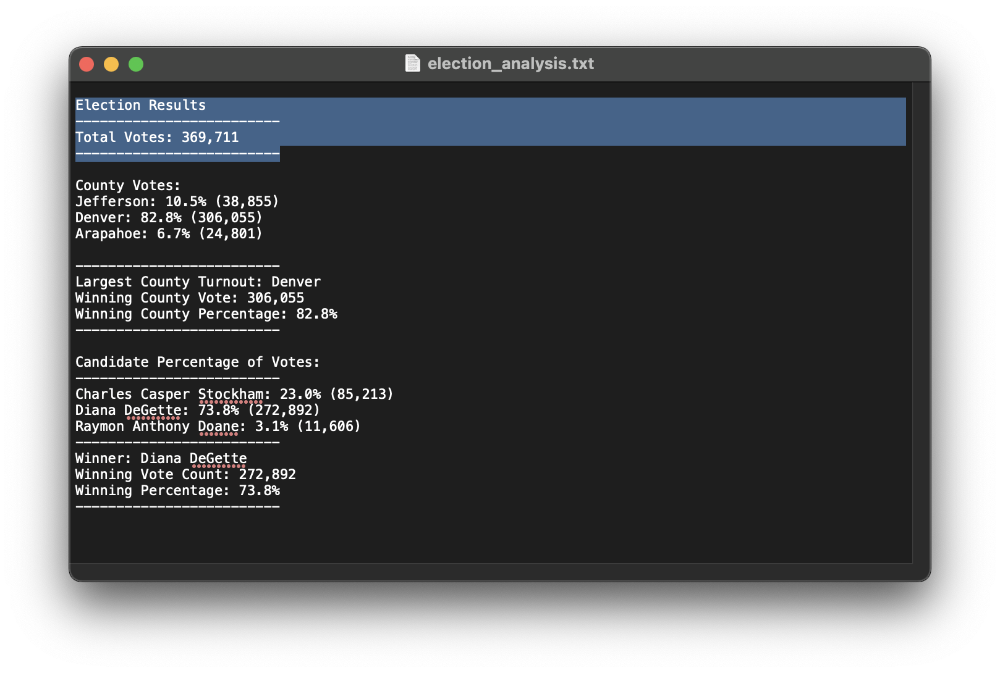
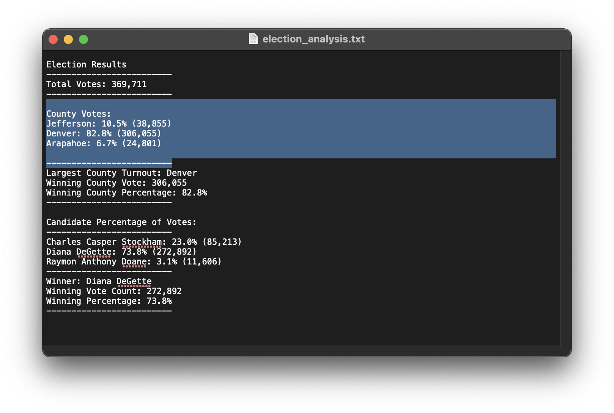
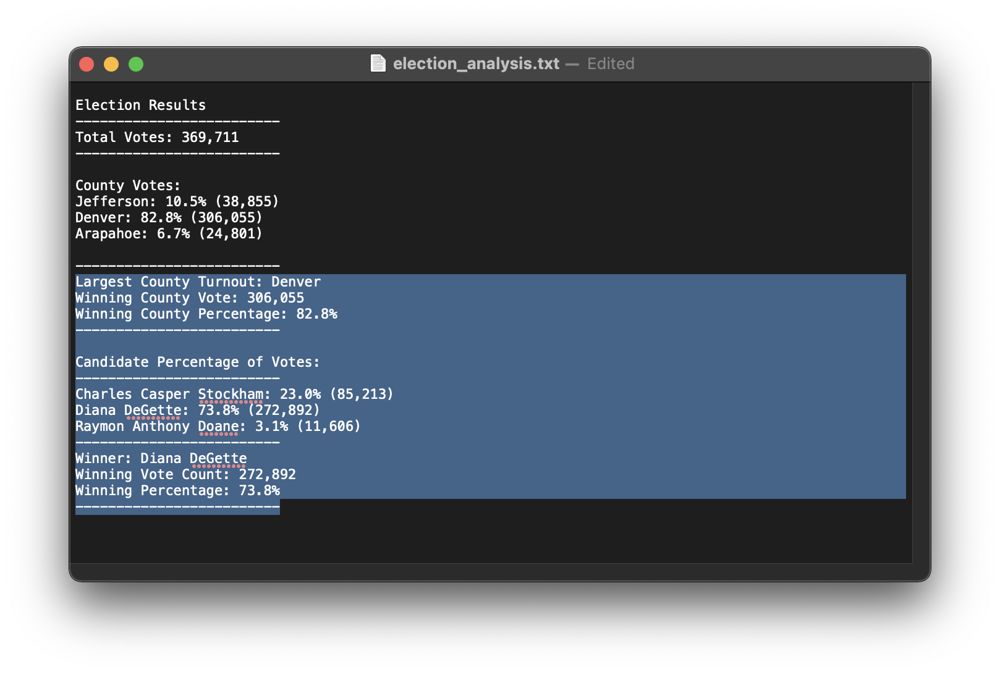

# Election Analysis

## Overview
I was asked to help Seth and Tom audit the election results for a recent election.

We utilized Python and its tools to perform the audit. 

## Election Audit Results
* Total Votes 369,711



* County Votes:
    * Jefferson: 10.5% (38,855)
    * Denver: 82.8% (306,055)
    * Arapahoe: 6.7% (24,801)
    


* Denver has had the largest amount of votes with 306,055 votes
* Diana DeGette won the election with 73.8% of the votes, which is 272,892




## Election Audit Summary

This code can be used for any election as the syntax is simple an clear. There was use of # to add comments to make it easy to read. In order to utilize this code for other election results, load the proper file into the resources folder and reference the it as shown below. 

```
# Add a variable to load a file from a path.
file_to_load = 'Resources/[file for election results].csv'
# Add a variable to save the file to a path.
file_to_save = 'analysis/election_analysis.txt'
```

Make sure to edit the print f statements to match. Not all elections will be for counties some may be for countries.
